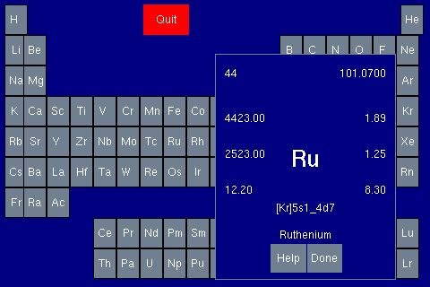

xpt is an ancient X11 program written by Joel P. Lord back in the
early 90's.

Around the time the Earth was still cooling, maybe in 1993 or 1994, I
hacked the xpt source code to add a line of information that showed
the ground state electronic structure of each element, because at that
time that sort of information was still important to me.

xpt has long ago vanished from any web sites I can find, and you can
only find dead links to information about it.

I dusted off the source code today and made it compile again with a
modern compiler.  It had rotted somewhat, because modern compilers are
more sticklers for passing correct types, and ints are no longer
equivalent to pointers.

I did away with the Imakefile, because I can't for the life of me make
it work anymore, and the program is far too simple to need such
overkill.  I replaced it with a simple Makefile that can be hand
edited in the one or two places where it might be needed (mostly
CPPFLAGS, LDFLAGS, CFLAGS).

You must have Athena widgets installed (libXaw) as well as X11
development libraries and headers.

